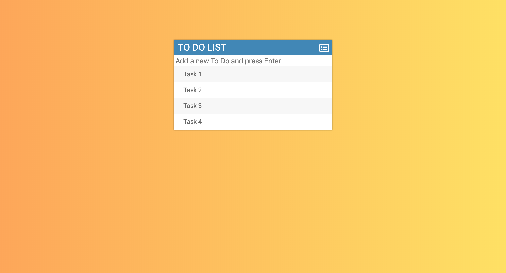

# Overview

To-do List is ana single page front-end app that allow user to create a list of daily tasks. The App has options to add or delete tasks depending on user's preference. It also allows user to makr tasks once they're done.

## Landing page
When you opens the app you'll see this page with some random tasks. Feel free, to replace them with your own taks.

## Tech Used

**Some of the tech I used to create this app**

* HTML5
* CSS 3
* Bootstrap 4
* Javascript
* jQuery

Feel free to clone this repo and create your own To-do List App.